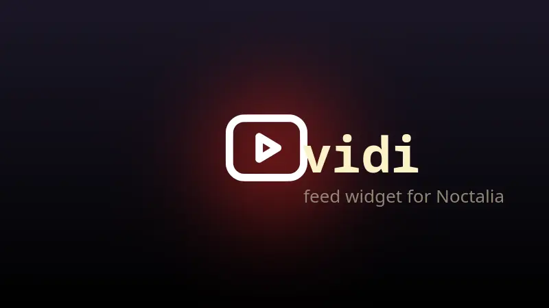

# Vidi plugin for Noctalia

A bar widget and panel showing the latest videos from [vidi](https://codeberg.org/Fel/Vidi)'s
subscription feed, right in your Noctalia v5 bar.



## Features

- **Bar widget** with an unread badge — shows how many videos have been published since
  you last checked the feed.
- **Panel** listing the newest videos (up to 30) with channel, duration, views and age.
- **Thumbnails** from vidi's preview image cache when available (`~/.cache/vidi/preview_images`).
- Click a video to play it **directly in vidi** (`vidi <url>` deep-link, vidi ≥ 0.5.0) —
  browser, mpv or copy-link are also selectable per settings.
- Shorts can be excluded from the list and the unread count.
- Efficient by design: reads vidi's feed cache (`~/.cache/vidi/feed_cache.json`) through
  a `jq` compaction pass so no script callback ever parses the full file.

## Requirements

| Dependency | Why |
|---|---|
| Noctalia v5 with `plugin_api` ≥ 24 | current shells ship API ≥ 26 |
| [vidi](https://codeberg.org/Fel/Vidi) ≥ 0.5.0 | feed cache + CLI deep-link |
| jq | compaction of the feed cache |

## Install

### Option A — as a plugin source (recommended)

Adding the repo as a source lets Noctalia track updates:

```sh
noctalia msg plugins source add fel git https://github.com/Fel-2/noctalia-vidi-plugin
```

Then enable the plugin:

```sh
noctalia msg plugins enable fel/vidi
```

and add the widget to your bar (Noctalia settings → bar, widget name `fel/vidi:latest`,
end zone is a good spot), or:

```sh
syskit bar widget-add end fel/vidi:latest --force   # if you use syskit
```

### Option B — manual

Clone anywhere and symlink into Noctalia's local plugin directory (same workflow used
during development):

```sh
git clone https://github.com/Fel-2/noctalia-vidi-plugin.git
ln -s "$(pwd)/noctalia-vidi-plugin" ~/.local/share/noctalia/plugins/vidi
noctalia plugins lint ~/.local/share/noctalia/plugins/vidi
noctalia msg plugins enable fel/vidi
```

Then add `fel/vidi:latest` to your bar layout via Noctalia's bar settings.

## Usage

| Gesture / action | Result |
|---|---|
| Widget left click | toggle the feed panel |
| Widget right click | open vidi in a terminal |
| Widget middle click | mark the whole feed as seen |
| Panel row click | open the video (default: play in vidi) |
| Panel copy button | copy the video URL |
| Panel header button | open vidi in a terminal |
| Opening the panel | marks the feed seen |

## Settings

| Setting | Default | Description |
|---|---|---|
| Maximum videos | 10 | how many videos the panel lists (3–30) |
| Include shorts | off | count and show YouTube shorts |
| Thumbnails | on | use thumbnails cached by vidi when available |
| Click action | Open in vidi | what happens on row click (vidi / mpv / browser / copy) |

## Notes

- The plugin only **reads** vidi's cache; refreshing happens inside vidi — open the
  Subscriptions screen there once before first use, and whenever you want fresh data.
  Until then the panel shows a hint instead of a list.
- The unread counter persists across shell restarts
  (`~/.local/state/noctalia/plugins/data/fel/vidi/seen.json`).

## License

MIT — see [LICENSE](LICENSE).
